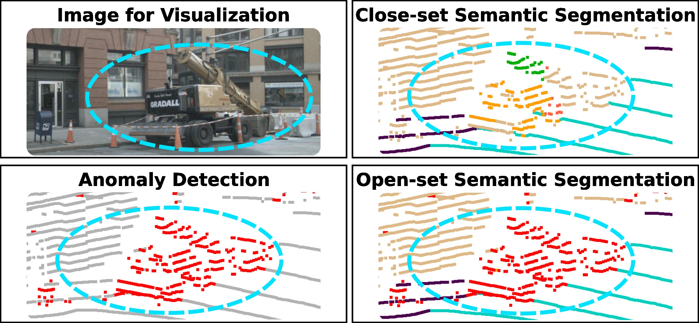
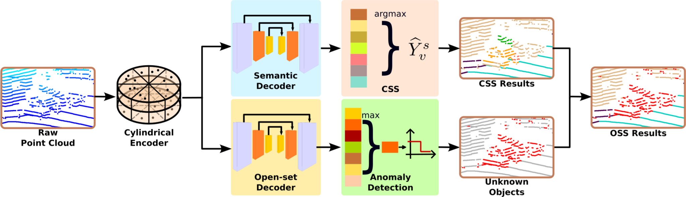

# DOSS

This repository contains the implementation of our paper, which was accepted by ICRA2025 :

> **A Novel Decomposed Feature-Oriented Framework for Open-Set Semantic Segmentation on LiDAR Data** \
> [Wenbang Deng](https://github.com/dwbzxc), [Xieyuanli Chen](https://github.com/Chen-Xieyuanli), Qinghua Yu, Yunze He, Junhao Xiao, Huimin Lu

If you use our code in your work, please star our repo and cite our paper.

```
@inproceedings{deng2025icra,
	title={{A Novel Decomposed Feature-Oriented Framework for Open-Set Semantic Segmentation on LiDAR Data}},
	author={Deng, Wenbang and Chen, Xieyuanli and Yu, Qinghua and He, Yunze and Xiao, Junhao and Lu, Huimin},
	booktitle={IEEE International Conference on Robotics and Automation (ICRA)},
	year={2025}
}
```

<div align=center>
 
</div>

**Visualization of open-set semantic segmentation.** Close-set segmentation (CSS) (top right) only predicts the known classes while recognizing the unknown *construction vehicle* in the blue ellipses as other known classes. Our method realizes anomaly detection (bottom left), i.e., segments unknown objects, and keeps the ability of CSS. Combining the two results above, we can finally achieve open-set semantic segmentation on LiDAR data (bottom right)

## Overview

<div align=center>
 
</div>

**Framework Overview.** We first project points to the cylindrical voxels and extract the point-wise feature from the raw point cloud in the cylindrical encoder. The obtained voxel features are fed to the dual decoders, i.e., semantic decoder and open-set decoder, generating distinct voxel features for guiding the known classes CSS and the anomaly detection of unknown objects. The close-set semantic results and the detected unknown objects are finally combined to realize effective open-set segmentation.

## News
- We use $\lambda_3$ = 0.3 to train for SemanticKITTI dataset and get a better results: `IoU = 57.7, AUPR = 52.3, AUROC = 88.9`. The pre-trained model is shared in the following [contents](#my-subheading).

## Installation

### Requirements
- PyTorch >= 1.2 
- yaml
- Cython
- [torch-scatter](https://github.com/rusty1s/pytorch_scatter)
- [nuScenes-devkit](https://github.com/nutonomy/nuscenes-devkit) (optional for nuScenes)
- [spconv](https://github.com/traveller59/spconv) (tested with spconv==1.2.1 and cuda==11.1)

## Data Preparation

### SemanticKITTI
```
./
├── 
├── ...
└── path_to_data_shown_in_config/
    ├──sequences
        ├── 00/           
        │   ├── velodyne/	
        |   |	├── 000000.bin
        |   |	├── 000001.bin
        |   |	└── ...
        │   └── labels/ 
        |       ├── 000000.label
        |       ├── 000001.label
        |       └── ...
        ├── 08/ # for validation
        ├── 11/ # 11-21 for testing
        └── 21/
	    └── ...
```

### nuScenes
```
./
├── ...
├── v1.0-trainval
├── v1.0-test
├── samples
├── sweeps
├── maps
└── lidarseg/
    ├──v1.0-trainval/
    ├──v1.0-mini/
    ├──v1.0-test/
    ├──nuscenes_infos_train.pkl
    ├──nuscenes_infos_val.pkl
    ├──nuscenes_infos_test.pkl
└── panoptic/
    ├──v1.0-trainval/
    ├──v1.0-mini/
    ├──v1.0-test/
```
where the .pkl files can be downloaded [here](https://github.com/xinge008/Cylinder3D/blob/master/NUSCENES-GUIDE.md).

## <a id="my-subheading"></a>Pre-trained models
The pre-trained models can be downloaded in [Baidu Netdisk](https://pan.baidu.com/s/1eop7VmpGce4HaCgJY4kFKA?pwd=nxmt) or [OneDrive](https://1drv.ms/f/c/1315967b62a00b4d/EqY-x5KlHzFDncJmvWilAwYBI4ISX-PKqXqqIOweFFquWQ?e=6UZh3B).


## Training
### Training for SemanticKITTI
Change the path of dataset and model path in `config/semantickitti_ood_final.yaml`, and then run:
```
cd semantickitti_scripts
python train_cylinder_asym_ood_final.py
```

### Training for nuScenes
Change the path of dataset and model_load_path and model_save_path in `config/nuScenes_ood_final.yaml`, and then run:
```
cd nuScenes_scripts
python train_cylinder_asym_nuscenes_ood_final.py
```

## Inference
### Infernce for SemanticKITTI
Run:
```
cd semantickitti_scripts
python val_cylinder_asym_ood.py --save_folder /path/to/your/save_folder
```
where `--save_folder` is the directory of saving segmentation results.

### Infernce for nuScenes
Run:
```
cd nuScenes_scripts
python val_cylinder_asym_nusc_ood.py --save_folder /path/to/your/save_folder
```
where `--save_folder` is the directory of saving segmentation results.

## Evaluation
We follow [the work of Cen et.al.](https://github.com/Jun-CEN/Open-world-3D-semantic-segmentation) and use [semantic_kitti_api](https://github.com/Jun-CEN/semantic_kitti_api) and [nuScenes_api](https://github.com/Jun-CEN/nuScenes_api) to evaluate the performance.


## Contact

Please contact us with any questions or suggestions!

Wenbang Deng: wbdeng@nudt.edu.cn and Xieyuanli Chen: xieyuanli.chen@nudt.edu.cn

## License

This project is free software made available under the MIT License. For details see the LICENSE file.

## Acknowledgments
We refer to the following open-source repository:
[Cylinder3D](https://github.com/xinge008/Cylinder3D) and [Open_world_3D_semantic_segmentation](https://github.com/Jun-CEN/Open-world-3D-semantic-segmentation).